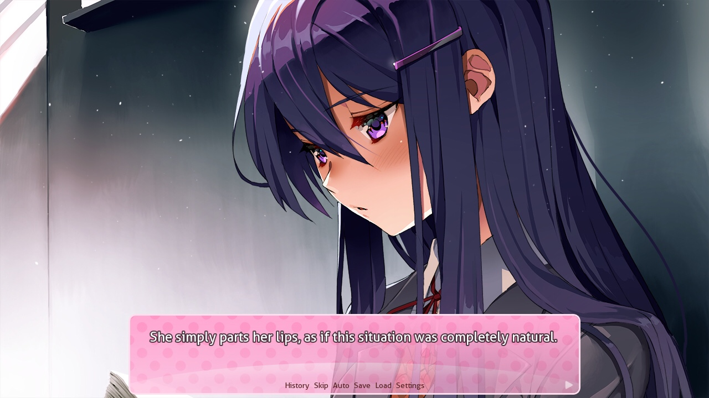
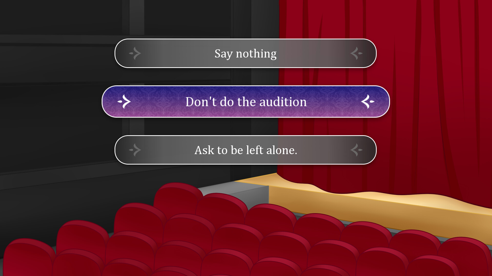

= Créer des jeux avec Ren 'Py
:nofooter:
:revealjs_theme: league
:revealjs_slideNumber: true
:source-highlighter: highlight.js

== Avant-propos

include::resources/components/foreword.adoc[]

=== Le moteur Ren'Py

Ren'Py est un moteur de jeu spécialisé pour la création de Visual Novel

=== Téléchargement

* Moteur de jeu: https://www.renpy.org/latest.html

include::resources/components/download_instructions.adoc[]

== Que peut-on faire avec Ren'Py ?

=== Des jeux d'horreur



[.notes]
--
jeu: https://store.steampowered.com/app/698780/Doki_Doki_Literature_Club/
--

=== Des jeux de romance

image::resources/images/game_snapshot_plea_1.png["The pleasuremancer - Forest Battle 2"]

[.notes]
--
jeu (18+): https://mirrodin.itch.io/the-pleasuremancer
--

=== Des combats

[cols="a,a", frame=none, grid=none]
|===
|
image::resources/images/game_snapshot_colo_1.gif["Colors - Association minigame"]
|
image::resources/images/game_snapshot_colo_2.gif["Colors - Fishing minigame"]
|
image::resources/images/game_snapshot_colo_3.gif["Colors - Memory minigame"]
|
image::resources/images/game_snapshot_colo_4.gif["Colors - Fruit cutter minigame"]
|===

[.notes]
--
jeu: https://kiminako.itch.io/colors
--

=== Tout simplement des jeux

[cols="a,a", frame=none, grid=none]
|===
|
image::resources/images/game_snapshot_wayc_4.gif["Where are you, Cinderella? - Tam chapter change scene"]
|
image::resources/images/game_snapshot_wayc_1.jpg["Where are you, Cinderella? - Crash scene"]
|

|
image::resources/images/game_snapshot_wayc_3.jpg["Where are you, Cinderella? - Alberto chapter change scene"]
|===

[.notes]
--
jeu: https://kiminako.itch.io/where-are-you-cinderella
--

== Créer un nouveau jeu

=== En tant que barbu

[%step]
* Créer le dossier du jeu
* Créer un dossier `game` dans le dossier
* Créer un fichier avec l'extension `rpy` dans le dossier `game` (ex: `game/script.rpy`)
* Créer un label `start` dans le fichier
* Créer un écran `yesno_choice` dans le fichier

=== En tant qu'humain

[%step]
* Lancer l'executable Ren'Py
* Cliquer sur `Créer un nouveau projet`
* Confirmer la langue utilisée
* Saisir le nom du projet
* Choisir les dimensions du jeu
* Choisir le thème de couleur du jeu

=== Structure d'un nouveau jeu

[graphviz]
....
graph {
    bgcolor = "#00000000"
    {
        node [shape=folder, style=filled, fillcolor="#fff"]
        "/" [label="MonJeu"];
        "/game" [label="game"];
        "/game/audio" [label="audio"];
        "/game/cache" [label="cache"];
        "/game/gui" [label="gui"];
        "/game/gui/button" [label="button"];
        "/game/gui/scrollbar" [label="scrollbar"];
        "/game/gui/slide" [label="slide"];
        "/game/gui/..." [label="..."];
        "/game/images" [label="images"];
        "/game/saves" [label="saves"];
        "/game/tl" [label="tl"];
        "/game/tl/None" [label="None"];
    }
    {
        node [shape=note, style=filled, fillcolor="lightblue"]
        "/log.txt" [label="log.txt"];
        "/game/gui.rpy" [label="gui.rpy"];
        "/game/options.rpy" [label="options.rpy"];
        "/game/screens.rpy" [label="screens.rpy"];
        "/game/script.rpy" [label="script.rpy", fillcolor="#ff5555"];
        "/game/*.rpyc" [label="*.rpyc"];
        "/game/gui/**.png" [label="*.png"];
        "/game/saves/navigation.json" [label = "navigation.json"];
        "/game/saves/persistent" [label = "persistent"];
        "/game/tl/None/common.rpym" [label="common.rpym"];
        "/game/tl/None/common.rpymc" [label="common.rpymc"];
    }
    "/" -- "/game";
    "/" -- "/log.txt";
    "/game" -- "/game/audio";
    "/game" -- "/game/cache";
    "/game" -- "/game/gui";
    "/game" -- "/game/images";
    "/game" -- "/game/saves";
    "/game" -- "/game/tl";
    "/game" -- "/game/gui.rpy";
    "/game" -- "/game/options.rpy";
    "/game" -- "/game/screens.rpy";
    "/game" -- "/game/script.rpy";
    "/game" -- "/game/*.rpyc";
    "/game/gui" -- "/game/gui/**.png"
    "/game/gui" -- "/game/gui/button"
    "/game/gui" -- "/game/gui/scrollbar"
    "/game/gui" -- "/game/gui/slide"
    "/game/gui" -- "/game/gui/..."
    "/game/gui/button" -- "/game/gui/**.png";
    "/game/gui/scrollbar" -- "/game/gui/**.png";
    "/game/gui/slide" -- "/game/gui/**.png";
    "/game/gui/..." -- "/game/gui/**.png";
    "/game/saves" -- "/game/saves/navigation.json";
    "/game/saves" -- "/game/saves/persistent";
    "/game/tl" -- "/game/tl/None"
    "/game/tl/None" -- "/game/tl/None/common.rpym";
    "/game/tl/None" -- "/game/tl/None/common.rpymc";
}
....

[.notes]
--
Le dossier 'audio' doit contenir les sons du jeu.

Le dossier 'cache' contient des fichiers générés par Ren'Py à ignorer.

Le dossier 'gui' contient les images d'interface générées par Ren'Py.

Le dossier 'images' contient les images de personnages et de lieu utilisées dans le jeu.

Le dossier 'saves' contient les sauvegardes du jeu, assurez-vous qu'il ne soit pas dans les archives de votre jeu que vous partagez.
Le fichier 'persistent' présent dedans sauvegarde les informations indépendantes d'une partie spécifique du joueur (typiquement sa configuration : le niveau du volume, la vitesse de défilement du texte, ...)

Le dossier 'tl' contient les fichiers de traduction du jeu., avec par défaut le dossier None qui traduit du texte utilisé par Ren'Py en interne.

Les noms et positions des fichiers `.rpy` sont indifférents : un fichier peut être déplacé n'importe où dans `game` et continuer à fonctionner. Les explications qui suivent sont pour les fichiers fournis par Ren'Py, et ne sont pas forcément valides pour tous les jeux.

Le fichier 'gui.rpy' contient la configuration par défaut des éléments du GUI (couleurs utilisées, positions des éléments, taille de l'écran, ...).

Le fichier 'options.rpy' contient la configuration du jeu (nom du jeu, numéro de version, fichiers à mettre dans les releases, ...).

Le fichier 'screens.rpy' contient les différents écrans utilisés dans le jeu (écrans de sauvegarde, écran titre, ...).

Le fichier 'script.rpy' contient le début du jeu.
--

== Fabriquer son jeu

=== Composants d'un jeu

[%step]
* Images
* Labels
* Choix
* Écrans
* Variables

=== Les images

[source, python]
----
image parc jour = "images/bg/parc_jour.png"
image lucien = "images/bg/parc_jour.png"
label start:
    scene parc jour
    lucien "Bonjour"
    show lucien at right with moveinright
    lucien "Que fais-tu ici ?"
    "Un drôle de personnage vous observe."
----

=== Les labels

Les labels constituent la trame narrative du jeu

[source, python]
----
label start:
    lucien "Bonjour"
    lucien "Que fais-tu ici ?"
    "Un drôle de personnage vous observe."
----

=== Les choix

Les choix permettent au joueur d'intervenir sur l'histoire

[source, python]
----
label start:
    lucien "Bonjour"
    lucien "Que fais-tu ici ?"
    "Un drôle de personnage vous observe."
    menu:
        "Qu'allez-vous faire ?"

        "Dire que vous êtes perdu":
            joueur "Je suis perdu."
        "Lui mettre un crochet du droit":
            "Oh que non mon bonhomme !"
            jump game_over
----

=== Les écrans

Les écrans permettent des interactions spécifiques poussées.

```py
label game_over:
    call screen game_over
screen game_over:
    text "Vous avez perdu!" align (0.5, 0.5)
    textbutton "Recommencer l'histoire":
        align (0.2, 0.8)
        action Jump("start")
    textbutton "Quitter le jeu":
        align (0.8, 0.8)
        action Quit(confirm = False)
```

[.notes]
--
Le  menu utilisé dans le label est un écran qui peut êre modifié
--

== Pour aller plus loin

=== Les images avec des couches

```py
layeredimage charly:
    always:
        "characters/charly/base_body.png"
    group "eyes":
        attribute empty default:
            None
```

=== Les transformations

