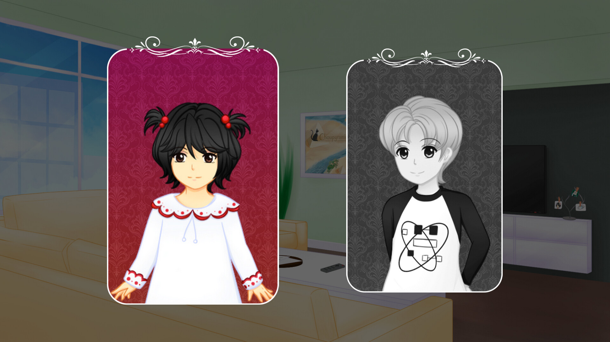
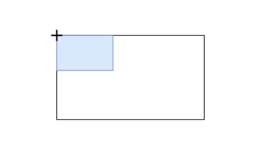
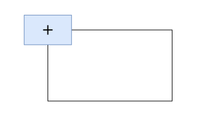
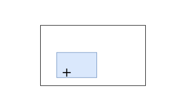

= Créer des jeux avec Ren 'Py
:nofooter:
:customcss: resources/theme/custom.css
:revealjs_theme: league
:revealjs_hash: true
:revealjs_slideNumber: true
:source-highlighter: highlight.js

[.notes]
--
Appuyer sur espace pour avancer dans la présentation, les notes visibles ici fourniront les explications allant avec le support.
--

include::resources/components/pre_slides.adoc[]

== Le moteur Ren'Py

image::resources/images/renpy_logo.png[]

Ren'Py est un moteur de jeu spécialisé pour la création de Visual Novel

[.notes]
--
Le moteur de jeu fonctionne à base de fichiers texte et utilise Python 3 dans les cas où de la programmation est requise pour obtenir un comportement particulier.
--

=== Téléchargement

Moteur de jeu : https://www.renpy.org/latest.html

include::resources/components/download_instructions.adoc[]

[.notes]
--
Téléchargez et installez la dernière version de Ren'Py pour suivre la présentation.
Il suffit de copier le contenu de l'archive dans un dossier et de lancer le programme `renpy` qu'il contient.
--

== Que peut-on faire avec Ren'Py ?

=== Des jeux d'horreur

image::resources/images/game_snapshot_doki_1.jpg["Doki Doki Litterature club - scene"]

[.notes]
--
Doki Doki Literature Club est un jeu qui se présente sous la forme d'un jeu de romance pour se transformer
par la suite en jeu d'horreur qui va jusqu'à permettre à ses joueurs de supprimer ou modifier des fichiers
du jeu pour changer son déroulement.

Le jeu a aussi de nombreux "mods" - des modifications créées par la communauté - qui sont rendus possibles et
simples à mettre en place par la nature ouverte et modulaire de Ren'Py.

jeu: https://store.steampowered.com/app/698780/Doki_Doki_Literature_Club/
--

=== Des jeux de romance

image::resources/images/game_snapshot_plea_1.png["The pleasuremancer - Forest Battle 2"]

[.notes]
--
The pleasuremancer est un eroge qui alterne phases de combat et narration en occupant l'entre-deux par des
mini-jeux (de dés, de cultivation, de fabrication, ...) et qui utilise des décors intéractifs pour permettre
aux joueurs curieux d'être récompensés pour avoir pris le temps de chercher les secrets des lieux qu'ils
explorent.

jeu (18+): https://mirrodin.itch.io/the-pleasuremancer
--

=== Des combats

[.no_padding_table, cols="a,a", frame=none, grid=none]
|===
|
image::resources/images/game_snapshot_colo_1.gif["Colors - Association minigame"]
|
image::resources/images/game_snapshot_colo_2.gif["Colors - Fishing minigame"]
|
image::resources/images/game_snapshot_colo_3.gif["Colors - Memory minigame"]
|
image::resources/images/game_snapshot_colo_4.gif["Colors - Fruit cutter minigame"]
|===

[.notes]
--
Colors est un petit jeu qui vise les enfants et alterne phases de narration et mini-jeux
pour raconter son histoire.

jeu: https://kiminako.itch.io/colors
--

=== Tout simplement des jeux

[.no_padding_table, cols="a,a", frame=none, grid=none]
|===
|
image::resources/images/game_snapshot_wayc_4.gif["Where are you, Cinderella? - Tam chapter change scene"]
|

|
image::resources/images/game_snapshot_wayc_2.jpg["Where are you, Cinderella?  Hospital scene"]
|

|===

[.notes]
--
Where are you Cinderella? (WAYC) est un pur "Visual Novel" où le joueur alterne lecture et choix pour
avancer dans le récit et influer dessus.

jeu: https://kiminako.itch.io/where-are-you-cinderella
--

== Créer un nouveau jeu

* Lancer l'executable Ren'Py
* Cliquer sur "`Créer un nouveau projet`"
* Confirmer la langue utilisée
* Saisir le nom du projet
* Choisir les dimensions du jeu
* Choisir le thème de couleur du jeu
* Importer les https://github.com/Ayowel/renpy-training-presentation/releases/latest/[assets] du jeu dans `game/`

[.notes]
--
La première fois qu'il est lancé, Ren'Py demandera la langue à utiliser dans l'interface.

Sélectionner 1920*1080 pour les dimensions du jeu, le reste est libre.

Après avoir créé le jeu, il faudra importer les fichiers sur lesquels repose le reste de la présentation dans le sous-dossier `game/` pour pouvoir la suivre dans les meilleures conditions.
--

=== Configurer l'éditeur utilisé

* Aller dans "`Préférences`"
* Sélectionner le répertoire que Ren'Py devrait utiliser pour les nouveaux projets
* Cliquer sur "`Editeur de texte`"
* Sélectionner l'éditeur à utiliser

[.notes]
--
Ren'Py peut installer Visual Studio Code lui-même, cependant si vous avez un autre éditeur de code ou que vous avez installé VSCode vous-même, il peut être préférable de l'indiquer à Ren'Py.

Ren'Py possède une extension VSCode qui proposera une coloration syntaxique et une aide à l'écriture du code.
Si vous utilisez un autre éditeur sans support explicite de Ren'Py, utiliser la cooration syntaxique de Python devrait être un paliatif décent.
--

=== Structure d'un nouveau jeu

[graphviz]
....
graph {
    bgcolor = "#00000000"
    {
        node [shape=folder, style=filled, fillcolor="#fff"]
        "/" [label="MonJeu"];
        "/game" [label="game"];
        "/game/audio" [label="audio"];
        "/game/cache" [label="cache"];
        "/game/gui" [label="gui"];
        "/game/gui/button" [label="button"];
        "/game/gui/scrollbar" [label="scrollbar"];
        "/game/gui/slide" [label="slide"];
        "/game/gui/..." [label="..."];
        "/game/images" [label="images"];
        "/game/saves" [label="saves"];
        "/game/tl" [label="tl"];
        "/game/tl/None" [label="None"];
    }
    {
        node [shape=note, style=filled, fillcolor="lightblue"]
        "/log.txt" [label="log.txt"];
        "/game/gui.rpy" [label="gui.rpy"];
        "/game/options.rpy" [label="options.rpy"];
        "/game/screens.rpy" [label="screens.rpy"];
        "/game/script.rpy" [label="script.rpy", fillcolor="#ff5555"];
        "/game/*.rpyc" [label="*.rpyc"];
        "/game/gui/**.png" [label="*.png"];
        "/game/saves/navigation.json" [label = "navigation.json"];
        "/game/saves/persistent" [label = "persistent"];
        "/game/tl/None/common.rpym" [label="common.rpym"];
        "/game/tl/None/common.rpymc" [label="common.rpymc"];
    }
    "/" -- "/game";
    "/" -- "/log.txt";
    "/game" -- "/game/audio";
    "/game" -- "/game/cache";
    "/game" -- "/game/gui";
    "/game" -- "/game/images";
    "/game" -- "/game/saves";
    "/game" -- "/game/tl";
    "/game" -- "/game/gui.rpy";
    "/game" -- "/game/options.rpy";
    "/game" -- "/game/screens.rpy";
    "/game" -- "/game/script.rpy";
    "/game" -- "/game/*.rpyc";
    "/game/gui" -- "/game/gui/**.png"
    "/game/gui" -- "/game/gui/button"
    "/game/gui" -- "/game/gui/scrollbar"
    "/game/gui" -- "/game/gui/slide"
    "/game/gui" -- "/game/gui/..."
    "/game/gui/button" -- "/game/gui/**.png";
    "/game/gui/scrollbar" -- "/game/gui/**.png";
    "/game/gui/slide" -- "/game/gui/**.png";
    "/game/gui/..." -- "/game/gui/**.png";
    "/game/saves" -- "/game/saves/navigation.json";
    "/game/saves" -- "/game/saves/persistent";
    "/game/tl" -- "/game/tl/None"
    "/game/tl/None" -- "/game/tl/None/common.rpym";
    "/game/tl/None" -- "/game/tl/None/common.rpymc";
}
....

[.notes]
--
Le dossier 'audio' doit contenir les sons du jeu.

Le dossier 'cache' contient des fichiers générés par Ren'Py à ignorer.

Le dossier 'gui' contient les images d'interface générées par Ren'Py.

Le dossier 'images' contient les images de personnages et de lieu utilisées dans le jeu.

Le dossier 'saves' contient les sauvegardes du jeu, assurez-vous qu'il ne soit pas dans les archives de votre jeu que vous partagez.
Le fichier 'persistent' présent dedans sauvegarde les informations indépendantes d'une partie spécifique du joueur (typiquement sa configuration : le niveau du volume, la vitesse de défilement du texte, ...)

Le dossier 'tl' contient les fichiers de traduction du jeu., avec par défaut le dossier None qui traduit du texte utilisé par Ren'Py en interne.

Les noms et positions des fichiers `.rpy` sont indifférents : un fichier peut être déplacé n'importe où dans `game` et continuer à fonctionner. Les explications qui suivent sont pour les fichiers fournis par Ren'Py, et ne sont pas forcément valides pour tous les jeux.

Le fichier 'gui.rpy' contient la configuration par défaut des éléments du GUI (couleurs utilisées, positions des éléments, taille de l'écran, ...).

Le fichier 'options.rpy' contient la configuration du jeu (nom du jeu, numéro de version, fichiers à mettre dans les releases, ...).

Le fichier 'screens.rpy' contient les différents écrans utilisés dans le jeu (écrans de sauvegarde, écran titre, ...).

Le fichier 'script.rpy' contient le début du jeu.
--

=== Organiser son projet

[graphviz]
....
graph {
    bgcolor = "#00000000"
    {
        node [shape=folder, style=filled, fillcolor="#fff"]
        "/" [label="MonJeu"];
        "/game" [label="game"];
        "/game/dir..." [label="..."];
        "/game/images" [label="images"];
    }
    {
        node [shape=folder, style=filled, fillcolor="lightgreen"]
        "/game/scripts" [label="scripts"]
        "/game/screens" [label="screens"]
        "/game/story" [label="story"]
        "/game/images/characters" [label="characters"]
        "/game/images/items" [label="items"]
        "/game/images/backgrounds" [label="backgrounds"]
    }
    {
        node [shape=note, style=filled, fillcolor="lightblue"]
        "/log.txt" [label="log.txt"];
        "/game/script.rpy" [label="script.rpy"];
        "/game/file..." [label="..."];
    }
    {
        node [shape=note, style=filled, fillcolor="#ff5555"]
        "/game/story/chapter1.rpy" [label="chapter1.rpy"]
        "/game/story/chapter2.rpy" [label="chapter2.rpy"]
        "/game/characters.rpy" [label="characters.rpy"]
        "/game/images.rpy" [label="images.rpy"]
        "/game/transforms.rpy" [label="transforms.rpy"]
    }
    "/" -- "/game";
    "/" -- "/log.txt";
    "/game" -- "/game/dir...";
    "/game" -- "/game/images";
    "/game" -- "/game/script.rpy";
    "/game" -- "/game/file...";
    "/game" -- "/game/characters.rpy"
    "/game" -- "/game/images.rpy"
    "/game" -- "/game/transforms.rpy"
    "/game" -- "/game/scripts"
    "/game" -- "/game/screens"
    "/game" -- "/game/story"
    "/game/images" -- "/game/images/characters"
    "/game/images" -- "/game/images/items"
    "/game/images" -- "/game/images/backgrounds"
    "/game/story" -- "/game/story/chapter1.rpy"
    "/game/story" -- "/game/story/chapter2.rpy"
}
....

[.notes]
--
Nous recommandons la création de dossiers et fichiers supplémentaires pur organiser le jeu.

Cette organisation est indicative et non impérative.

Les fichiers peuvent être n'importe où dans le dossier `game` sans que leur position pose de problème.
--

== Composants d'un jeu

* Labels
* Images
* Choix
* Écrans
* Styles
* Transform

[.notes]
--
Les slides qui suivent se basent sur un nouveau jeu dans lequel les ressources de présentation disponibles pour
l'entrainement auraient été copiées.

Par la suite, les lignes commençant par un "-" sont les lignes du fichier à retirer, celles commençant par un "+" sont les lignes à ajouter.
--

=== Les labels

[source, diff]
----
-define e = Character('Eileen', color="#c8ffc8")
+define charly = Character('Charly', color="#c8ffc8")

 label start:
-    e "Vous venez de créer un nouveau jeu Ren'Py."
-    e "Après avoir ajouté une histoire, des images et de la musique, vous pourrez le présenter au monde entier !"
+    charly "Bonjour"
+    "Vous regardez autour de vous sans voir personne"
     return
----

[.notes]
--
Les labels sont la trame narrative de l'histoire

Créez des labels pour séparer le texte de l'histoire en blocs logiques.
Les labels sont le coeur de Ren'Py et c'est d'eux que partent toutes les actions.

Créez des personnages avec `define` et `Character` et utilisez-les dans l'histoire pour créer des discussions dans votre jeu.
--

=== Les images

[source, diff]
----
+image town = "images/backgrounds/town.jpg"
+image charly = "images/characters/charly_base.png"
+image charly smiling = "images/characters/charly_smiling.png"

 define charly = Character('Charly', color="#c8ffc8")

 label start:
+    scene town
     charly "Bonjour"
     "Vous regardez autour de vous sans voir personne"
+    show charly at center with moveinbottom
+
+    charly "Bonjour !"
+    show charly smiling
+    charly "Je suis cool, hein ?"
     return
----

[.notes]
--
Le jeu par défaut est un peu morne, ajoutons un décor et des images et affichons-les au début de l'histoire dans `game/script.rpy`.

Ici, un ajoute une scène de "ville" et on affiche Charly, notre personnage, en le faisant glisser dans la scène à son arrivée et en le faisant sourire peu après.
--

=== Les choix

Les choix donnent des options au joueur.

[source, diff]
----
     charly "Je suis cool, hein ?"
+    menu:
+        "Oui":
+            charly "Je le savais !"
+        "Non":
+            show charly -smiling
+            "Oh..."
+    charly "Je me demandais, tu as vu Michelle ?"
     return
----

[.notes]
--
Les choix permettent d'intéragir avec le joueur et de lui donner du contrôle sur le déroulement de l'histoire.
Ils peuvent être anodins ou capitaux, à vous de décider!

Ici, selon la réponse du joueur, charly perdra ou non son sourire pour la suite de la conversation. Un choix
des plus terribles, vous en conviendrez.
--

=== Les écrans

Les écrans permettent des interactions poussées.

[source, py]
----
screen choice(items):
    style_prefix "choice"

    vbox:
        for i in items:
            textbutton i.caption action i.action
----

[.notes]
--
Toutes les interactions avec le joueur passent par le biais d'un écran, ici nous faisons un zoom sur un des écrans par défaut de Ren'Py.

Lors de l'usage d'un menu dans un label, c'est cet écran qui gère l'affichage des options proposées au joueur.

Cet écran est défini dans le fichier `game/screens.rpy` par défaut.
On parlera séparément de ses différents éléments par la suite.
--

=== Les styles

Les styles permettent de réutiliser des règles d'affichage et de les généraliser.

[source, py]
----
style choice_vbox is vbox
style choice_button is button
style choice_button_text is button_text

style choice_vbox:
    xalign 0.5
    ypos 405
    yanchor 0.5

    spacing gui.choice_spacing
----

[.notes]
--
Ici, on s'intéressera aux styles utilisés dans l'écran précédent.

Les boutons et leur texte sont des bouton classiques, là où la vbox (qui fait que les boutons sont empilés verticalement)
a des attribut supplémentaires pour la positionner et bien afficher son contenu.
--

=== Les transform

Les `transform` permettent de modifier et d'animer des images.

[source, diff]
----
+transform middle():
+    align (0.5, 0.5)
+
 label start:
     scene town
     charly "Bonjour"
     "Vous regardez autour de vous sans voir personne"
-    show charly at center with moveinbottom
+    show charly at middle with moveinbottom
----

[.notes]
--
Ici, la transform a pour simple objectif de positionner Charly a un endroit en particulier, mais on pourrait aussi l'utiliser pour animer celui-ci.
--

== Le positionnement dans Ren'Py

=== La position

[cols="^.^a,^.^a", frame=none, grid=all]
|===
|
[.small]
pos (0., 0.) +

|
[.small]
pos (0.5, 0.5) +
image:resources/graphs/positioning_position_center.drawio.svg["Ancre au centre de l'écran",300]
|
[.small]
pos (1., 1.) +
image:resources/graphs/positioning_position_bottom_right.drawio.svg["Position en bas à droite de l'image",300]
|
[.small]
pos (1/4., 4/5.) +
image:resources/graphs/positioning_position_1d4_4d5.drawio.svg["Ancre en 1/4 et 4/5",300]
|===

[.notes]
--
En bleu l'image, en noir la surface d'affichage.

La position peut être exprimée en pixels entiers ou en proportion (valeurs flottantes de 0. à 1.) de la surface du support d'affichage.

Le positionnement d'une image défini avec `pos` déplace son coin supérieur gauche par défaut.
--

=== L'ancre

[cols="^.^a,^.^a", frame=none, grid=all]
|===
|
[.small]
anchor (0., 0.) +

|
[.small]
anchor (0.5, 0.5) +

|
[.small]
anchor (1., 1.) +
image:resources/graphs/positioning_anchor_bottom_right.drawio.svg["Ancre en bas à droite de l'image",300]
|
[.small]
anchor (1/4., 4/5.) +
image:resources/graphs/positioning_anchor_1d4_4d5.drawio.svg["Ancre en 1/4 et 4/5",300]
|===

[.notes]
--
En bleu l'image, en noir la surface d'affichage.

L'ancre peut être exprimée en pixels ou en proportion (de 0. à 1.) de la surface de l'image.

L'ancre d'une image définie avec `anchor` déplace le point de l'image utilisé pour les traitements faits dessus (positionnement avec `pos` ou rotation avec une transform).
--

=== L'alignement

[cols="^.^a,^.^a", frame=none, grid=all]
|===
|
[.small]
align (0., 0.) +

|
[.small]
align (0.5, 0.5) +
image:resources/graphs/positioning_align_center.drawio.svg["Alignement au centre",300]
|
[.small]
align (1., 1.) +
image:resources/graphs/positioning_align_bottom_right.drawio.svg["Alignement en bas à droite",300]
|
[.small]
align (1/4., 4/5.) +

|===

[.notes]
--
En bleu l'image, en noir la surface d'affichage.

L'alignement est à exprimer en proportion (de 0. à 1.) de la surface de l'image et de la surface du support d'affichage. Définir un alignement revient à définir l'ancre et la position à sa valeur, il s'agit d'une valeur synthétique qui permet de facilement positionner une image.
--

== Créer un jeu

=== Passer d'un label à l'autre

[source, diff]
----
     charly "Je me demandais, tu as vu Michelle ?"
+    jump chapitre1
-    return
+
+label chapitre1:
+    charly "J'ai perdu Michelle de vue depuis hier."
+    charly "Elle n'est ni à la maison, ni au jardin."
----

[.notes]
--
La narration étant faite de labels, il est nécessaire de pouvoir passer d'un label à l'autre, ce que fait le `jump`.

A noter que, si Ren'Py arrive à la fin d'un label, il passera automatiquement au suivant dans le fichier.
Le jump donné en exemple n'est donc pas nécessaire dans ce cas particulier.
--

=== Appeler des labels

[source, diff]
----
 label chapitre1:
     charly "J'ai perdu Michelle de vue depuis hier."
     charly "Elle n'est ni à la maison, ni au jardin."
+    charly "Je revenais de l'étang quand... ah, l'étang..."
+    call jeu_poisson
+    charly "Quoi qu'il en soit... pourrais-tu m'aider ?"
+
+label jeu_poisson:
+    charly "Quel est le nom de ce poisson déjà ?"
+    return
----

[.notes]
--
A la différence d'un saut fait avec `jump`, un appel de label fait avec `call` se "souvient" d'où il a été fait et peut
donc être utilisé pour faire un aparté pour une intéraction particulière avec le joueur.

Un label appelé avec un `call` devrait contenir un `return` à un moment ou effectuer un `jump` vers un autre label qui
fera le `return` plus tard.
--

=== Demander des valeurs à l'utilisateur

[source, diff]
----
+default jeu_poisson_nom_poisson = ""
+image objet_truite = "images/objets/truite.png"
 label jeu_poisson:
     charly "Quel est le nom de ce poisson déjà ?"
+    show objet_truite
+    $ jeu_poisson_nom_poisson = renpy.input("")
     return
----

[.notes]
--
Certaines intéractions requièrent de demander à l'utilisateur de saisir du texte, ce qui est possible avec `renpy.input`.

Ici, on demande au joueur d'identifier un poisson qu'on lui montre à l'écran.
Le résultat est ensuite stocké dans la variable `jeu_poisson_nom_poisson` et pourra être controlé ultérieurement.

Si vous avez l'oeil acéré, vous aurez noté qu'on a utilisé `define` au début pour déclarer notre personnage, et ici `default`
pour déclarer notre variable. De manière générale, `default` doit être utilisé pour les éléments variables de l'histoire, et
`define` pour les éléments constants.
--

=== Faire subir au joueur les conséquences de ses décisions

[source, diff]
----
 label jeu_poisson:
     charly "Quel est le nom de ce poisson déjà ?"
     show objet_truite
     $ jeu_poisson_nom_poisson = renpy.input()
+    if 'truite' != jeu_poisson_nom_poisson:
+        charly "Je n'en suis pas si sûr..."
+    else:
+        charly "Oh oui, c'est ça !"
     return
----

[.notes]
--
Il est possible d'utiliser des conditions dans les labels pour décider ou non de dire quelque chose au joueur.

Ici, pour contrôler la réponse donnée à la question d'identification de poisson et afficher un texte en conséquence.
--

=== Utiliser des variables dans le texte

[source, diff]
----
 label jeu_poisson:
     charly "Quel est le nom de ce poisson déjà ?"
     show objet_truite
     $ jeu_poisson_nom_poisson = renpy.input("")
     if 'truite' != jeu_poisson_nom_poisson:
-        charly "Je n'en suis pas si sûr..."
+        charly "[jeu_poisson_nom_poisson] ? Je n'en suis pas si sûr..."
     else:
         charly "Oh oui, c'est ça !"
     return
----

[.notes]
--
Lorsque nécessaire, il est même possible d'afficher un texte sauvegardé dans une variable afin de rappeler au joueur sa réponse.
--

=== Créer des boucles

[source, diff]
----
+default nom_joueur = ""
+define joueur = Character("[nom_joueur]")
----
[source, diff]
----
     call jeu_poisson
     charly "Quoi qu'il en soit... pourrais-tu m'aider ?"
+    charly "Au fait, comment t'appelles-tu ?"
+    while '' == nom_joueur:
+        $ nom_joueur = renpy.input("")
+        if '' == nom_joueur:
+            charly "Mais ce n'est pas un nom ça !"
+    joueur "Je m'appelle [nom_joueur]"
     return
----

[.notes]
--
Et afin de s'assurer que le joueur ne puisse échapper à une décision, il est possible de boucler - potentiellement indéfiniment - tant
que le joueur ne fournit pas une réponse satisfaisante. Ici, pour choisir un prénom.
--

=== Les sons et musiques

```diff
+define audio.miaulement_chat = "sound/Chat_miaulement.ogg"
+define audio.ambiance_catnap = "music/Catnap.ogg"

 label start:
     scene town
+    play music ambiance_catnap
+    play sound miaulement_chat
     charly "Bonjour"
```

[.notes]
--
Et que serait un jeu sans une bande son ? De la même manière qu'il est possible d'afficher des images,
il est possible de jouer des sons simplement en les ayant préalablement déclarés.

Les musiques lancées se joueront indéfiniment (ou jusqu'à ce qu'une autre la remplace), tandis que les
sons ne seront joués qu'une fois.
--

=== Créer un écran simple

[source, diff]
----
+screen game_over:
+    add "black" alpha 0.8
+    text "Vous avez perdu!":
+        align (0.5, 0.5)
+    textbutton "Recommencer l'histoire":
+        align (0.2, 0.8)
+        action Jump("start")
+    textbutton "Quitter le jeu":
+        align (0.8, 0.8)
+        action Quit(confirm = False)
----

[source, diff]
----
             show charly -smiling
             "Oh..."
+            call screen game_over
     charly "Je me demandais, tu as vu Michelle ?"
     return
----

[.notes]
--
Il est possible de créer des écrans sur mesure, ici un écran de Game Over renvoyant le joueur au début de l'histoire.

Un écran peut être appelé comme le serait un label en précisant `screen` dans l'instruction.
--

== Traduire son jeu

* Aller dans le menu Ren'Py
* Sélectionner "`Générer les fichiers de traduction`"
* Choisir un nom de langue
* Décocher "`Génère des chaînes de caractères vides pour les traductions`"
* Cliquer sur "`Générer les fichiers de traduction`"
* Les traductions à éditer sont dans "`game/tl`"

[.notes]
--
Ren'Py permet de générer des fichiers contenant les lignes de texte à traduire.

Suivre les instructions de la diapositive pour les générer, il faudra ensuite traduire le texte présent dans les fichiers générés.
--

=== Utiliser la traduction

```diff
 screen preferences():
      # [...] Des éléments de l'écran ici
           vbox:
                style_prefix "check"
                label _("Avance rapide")
                textbutton _("Texte non lu") action Preference("skip", "toggle")
                textbutton _("Après les choix") action Preference("after choices", "toggle")
                textbutton _("Transitions") action InvertSelected(Preference("transitions", "toggle"))
+          textbutton _("Anglais") action Language("english")
+          textbutton _("Français") action Language(None)
```

[.notes]
--
Ajouter des boutons dans les préférences pour permettre au joueur de passer d'une langue à l'autre.

Les texte affichés dans les labels sont tous automatiquement traduit mais il n'en va pas de même pour les textes des écrans,
raison pour laquelle les textes devant être traduit doivent être passés à la fonction `_` pour être marqués comme étant traduisibles.
--

=== Traduire des ressources

[graphviz]
....
graph {
    bgcolor = "#00000000"
    {
        node [shape=folder, style=filled, fillcolor="#fff"]
        "/game" [label="game"];
        "/game/tl" [label="tl"];
        "/game/tl/english" [label="english"];
    }
    {
        node [shape=folder, style=filled, fillcolor="lightblue"]
        "/game/images" [label="images"];
        "/game/images/characters" [label="characters"];
        "/game/tl/english/images" [label="images"];
        "/game/tl/english/images/characters" [label="characters"];
    }
    {
        node [shape=note, style=filled, fillcolor="lightblue"]
        "/game/images/characters/charly.png" [label="charly.png"];
        "/game/tl/english/images/characters/charly.png" [label="charly.png"];

    }
    "/game" -- "/game/images";
    "/game/images" -- "/game/images/characters";
    "/game/images/characters" -- "/game/images/characters/charly.png";
    "/game" -- "/game/tl";
    "/game/tl" -- "/game/tl/english"
    "/game/tl/english" -- "/game/tl/english/images";
    "/game/tl/english/images" -- "/game/tl/english/images/characters";
    "/game/tl/english/images/characters" -- "/game/tl/english/images/characters/charly.png";
}
....

[.notes]
--
Il est possible d'utiliser des versions d'images ou de sons spécifiques dans les langues traduites. Pour cela, il suffit de mettre dans le dossier de traduction le fichier avec le même chemin que celui trouvable dans le dossier de base du jeu.
--

=== Editer les fichiers traduits

.Fichier de traduction dans `game/tl`
[source, py]
--
# game/script.rpy:4
translate english start_3c8fc231:

    # charly "Bonjour"
    charly "Hi"
--

[source, diff]
--
 label start:
     scene town
     play sound miaulement_chat
-    charly "Bonjour"
+    charly "Bonjour !" id start_3c8fc231
--

[.notes]
--
Les traductions du texte des labels utilisent des identifiants générés sur la base du contenu traduit.

Lors de modifications du texte, éviter la création de nouvelles entrées de traduction, il peut être souhaitable de spécifier explicitement l'identifiant qui avait été généré avant la modification.

Cela permettra de faire que le jeu continue à utiliser les anciennes traductions.
--


== Pour aller plus loin

=== Partager son jeu

* Aller dans le menu Ren'Py
* Sélectionner le jeu dans les projets
* Cliquer sur "`Compiler les paquets`"
* Sélectionner les OS ciblés
* Cliquer sur "`Compiler`"

[.notes]
--
Suivre les instructions pour créer une version partageable du jeu.

Par défaut, les fichiers à partager seront dans un dossier 'NomDuJeu-dists' dans le dossier parent du projet.

**Attention:** de base, Ren'Py mettera tous les fichiers présents dans le dossier de votre projet dans l'archive.
Assurez-vous de ne pas laisser de fichiers contenant des informations privées dans le dossier de votre projet lorsque vous générez une version de votre projet.
--

=== Les images avec des couches

[source, diff]
----
-image charly = "images/characters/charly_base.png"
-image charly smiling = "images/characters/charly_smiling.png"
----

[source, diff]
----
+layeredimage charly:
+    always:
+        "characters/charly/charly_base.png"
+    group mouth auto:
+        attribute neutral default
+        attribute smiling
+    group hat auto:
+        attribute base_hat default
+    group clothes auto:
+        attribute base_clothes default
+    group glasses auto:
+        attribute base_glasses default
+    group eyes:
+        attribute base_eyes default:
+            pos (62, 75)
----

[.notes]
--
Plutôt que d'utiliser de multiples images de personnage, il est possible d'obtenir une grande variété d'expressions
avec un plus faible nombre d'images en réutilisant un nez par ci ou des yeux par là. Pour ce faire, il faut utiliser
des images à couches.

Ces images permettent de définir une apparence par défaut qui sera "surchargée" par d'autres apparences selon les noms
d'attributs fournis. Chaque attribut se verra associé une image définie explicitement (comme dans le `always`) ou
implitement selon le nom de la layeredimage, le groupe, et l'attribut considérés.

Ici, l'attribut "smiling" peut être ajouté ou retiré de Charly pour ne modifier que la forme de sa bouche, tandis que
les yeux sont une petite image positionnée manuellement sur Charly.
--

=== Les transform

[source, diff]
----
+transform blink_eyes(): # Blink every 8 seconds
+    yzoom 1.
+
+    pause 8.
+    ease 0.1 yzoom 0.2
+    ease 0.1 yzoom 1.
+    repeat
----

[source, diff]
----
     group eyes:
         attribute base_eyes default:
-            pos (62, 75)
+            pos (62, 91) yanchor 0.5
+            at blink_eyes()
----

[.notes]
--
Pour animer des images avec des transform, il faut décrire les séquences de modification, typiquement sous la forme `WARPER TIME [TARGET VALUE]...`.

Le `TIME` est le temps que doit prendre une animation.

Le `[TARGET VALUE]` est un ensemble de valeurs que devront avoir les attributs de l'image à la fin de l'animation.

Le `WARPER` est la manière de laquelle l'animation doit avoir lieu (typiquement, `linear` ou `ease`).
--

=== Exécuter du code Python au démarrage

[source, diff]
----
+init python:
+     def filtrer_nom_poisson(name):
+         return name.strip().lower()
----

[source, diff]
----
     $ jeu_poisson_nom_poisson = renpy.input("")
-    if 'truite' != jeu_poisson_nom_poisson:
+    if 'truite' != filtrer_nom_poisson(jeu_poisson_nom_poisson):
         charly "[jeu_poisson_nom_poisson] ? Je n'en suis pas si sûr..."
----

[.notes]
--
Ren'Py permet de créer des blocs de code qui seront exécutés au démarrage du jeu.
Ces blocs contiennent typiquement les fonctions et classes qui sont utilisés dans le reste du jeu.
--

=== Les variables persistentes

[source, diff]
----
+default persistent.game_started = False
----

[source, diff]
----
 label start:
+    $ persistent.game_started = True
----

[source, diff]
----
 screen navigation():
   vbox:
     # [...] Des choses ici
     if main_menu:
-      textbutton _("Nouvelle partie") action Start()
+      if persistent.game_started:
+        textbutton _("Première partie") action Start()
+      else:
+        textbutton _("Nouvelle partie") action Start()
----

[.notes]
--
Les variables persistentes sont sauvegardées indépendamment des sauvegardes de parties et permettent notamment de mémoriser les préférences de configuration du joueur ou, comme ici, d'ajouter des comportements spécifiques selon des actions passées du joueur.

A noter: les variables persistentes ne devraient contenir que des types pythons de base (des nombres, des chaînes de caractères, des listes et des dictionnaires), pas des class custom car celles-ci ne seront pas encore disponibles au moment ou les valeurs persistentes seront chargées.
--

== Les éléments d'écran

=== Eléments d'affichage

[cols="^a,^a", frame=none, grid=none]
|===
|
```py
text _("Texte")
```
|
```py
label _("Label")
```
|
```py
add "une_image"
```
|
```py
image "une_image"
```
|===

[.notes]
--
Les éléments `text` et `label` permettent d'afficher du texte.
Les labels encapsulent le texte dans une fenêtre qui peut être utilisée pour appliquer des styles particuliers.

Les éléments `add` et `image` sont des alias l'un de l'autre et permettent d'afficher un `Displayable` arbitraire (qui peut être une image, mais aussi un élément d'affichage customisé, une transform, ...).
`image` est aujourd'hui déprécié et ne devrait pas être utilisé pour créer de nouveaux éléments.
--

=== Eléments d'interaction

[cols="^a,^a", frame=none, grid=none]
|===
|
```py
button:
    action NullAction()
```
|
```py
textbutton "texte":
    action NullAction()
```
|
```py
imagebutton:
    action NullAction()
    auto "image_%s"
```
|
```py
mousearea:
    hovered NullAction()
    unhovered NullAction()
```
|
```py
input:
```
|
```py
key "k":
    action NullAction()
```
|===

[.notes]
--
Les variantes de bouton `button`, `textbutton` et `imagebutton` permettent de réagir au clic et au passage de la souris avec des `action`s spécifiques.
Si le joueur joue au clavier ou à la souris, Ren'Py fera aussi en sorte que les flèches du clavier permettent de naviguer d'un bouton à l'autre.

`input` permet d'attendre une saisie de texte par l'utilisateur.

`mousearea` crée des zones interactibles sur un écran, par exemple pour faire apparaître un bouton au passage de la souris sur un zone spécifique de l'écran.

`key` permet d'associer des actions spécifiques à des touches du clavier (par exemple pour créer des boutons on/off pour des menus particuliers).
--

=== Eléments de structure

[cols="^a,^a", frame=none, grid=none]
|===
|
fixed:
[graphviz]
....
graph {
    node [shape="square", style="filled", fillcolor = "#fff"]
    bgcolor = "#00000000"
    1
}
....
|
hbox:
[graphviz]
....
graph {
    node [shape="square", style="filled", fillcolor = "#fff"]
    bgcolor = "#00000000"
    { rank=same 1 2 }
    1 -- 2
}
....
|
grid:

[graphviz]
....
graph {
    node [shape="square", style="filled", fillcolor = "#fff"]
    bgcolor = "#00000000"
    { rank=same 1 2 }
    { rank=same 3 4 }
    1 -- 2
    1 -- 3
    3 -- 4
    2 -- 4
}
....
|
vbox:

[graphviz]
....
graph {
    node [shape="square", style="filled", fillcolor = "#fff"]
    bgcolor = "#00000000"
    1 -- 2
}
....
|===

// TODO: add frame and window usage

== Pour aller beaucoup plus loin

=== Les transform - en parallèle

[source, diff]
----
+transform cool_glasses_appear():
+    yoffset -100
+    xoffset -50
+    parallel:
+        linear 2. yoffset 0
+    parallel:
+        easein 1.5 xoffset 0
----

[source, diff]
----
     group glasses auto:
         attribute base_glasses default
+        attribute cool_glasses:
+            at cool_glasses_appear()
----

[source, diff]
----
     menu:
         "Oui":
+            show charly cool_glasses with dissolve
             charly "Je le savais !"
----

=== Les shaders

[source, diff]
----
+init python:
+    renpy.register_shader("example.gradient", variables="""
+        uniform vec4 u_left_color;
+        uniform vec4 u_right_color;
+        uniform vec2 u_model_size;
+        varying float v_gradient_done;
+        attribute vec4 a_position;
+    """, vertex_300="""
+        v_gradient_done = a_position.x / u_model_size.x;
+    """, fragment_300="""
+        float gradient_done = v_gradient_done;
+        gl_FragColor *= mix(u_left_color, u_right_color, gradient_done);
+    """)
----

[source, diff]
----
+transform gradient:
+    shader "example.gradient"
+    u_left_color (1.0, 0.0, 0.0, 1.0)
+    u_right_color (0.0, 0.0, 1.0, 1.0)
----

// TODO: test, fix, and clarify

[source, diff]
----
+    show charly at gradient
----

[.notes]
--
Les shaders permettent de faire des modifications complexes sur des images.
Ici, par exemple, le shader modifiera "simplement" les couleurs de Charlie d'une couleur (à gauche) à l'autre (à droite).
--

// === Live2D
//
// TODO: add slide on Live2D https://www.youtube.com/watch?v=5xF6-8ECQxQ

== Pour aller trop loin

[.notes]
--
Les fonctionnalités qui suivent ne sont pas documentées et aucun support ne sera fourni dessus par le/les mainteneurs de Ren'Py.

Elles sont documentées ci-après dans un but informatif et éducatif.
--

=== Un petit jeu

[source, python]
----
label start:
    "Bonjour"
    $ renpy.quit()

screen yesno_prompt(message, yes_action, no_action):
    add "black" alpha 0.8
    window:
        style_prefix "yesno_prompt"
        vbox:
            text message
            textbutton _("Oui") action yes_action
            textbutton _("Non") action no_action

style yesno_prompt_button_text is button_text:
    hover_color "#f0f"
----

[.notes]
--
Il est possible de créer un nouveau jeu Ren'Py sans passer par l'interface graphique. En effets, un simple label `start` dans un fichier `*.rpy` est tout ce dont Ren'Py a besoin pour pouvoir lancer un jeu.

Ne reste qu'à définir l'écran utilisé lorsque le joueur tente de quitter le jeu pour avoir un "jeu" entièrement fonctionnel.
--

=== La ligne de commande

[source, bash]
----
# Vérifie qu'il n'y a pas d'erreurs/anomalies dans le jeu
renpy.sh 'chemin/du/jeu' lint --error-code

# Génère les fichiers de traduction en anglais
renpy.sh 'chemin/du/jeu' translate 'english'

# Crée les binaires à distribuer du jeu
renpy.sh '' distribute 'chemin/du/jeu'

# Crée les binaires android du jeu
renpy.sh '' android_build 'chemin/du/jeu'
----

[.notes]
--
Ren'Py expose des commandes équivalentes à celles disponibles par l'interface du launcher. Certaines commandes sont fournies directement par le moteur Ren'Py (comme `lint` et `translate`), d'autres sont fournies par le launcher, référencé en en donnant le chemin d'accès ou en fournissant un paramètre vide (comme `distribute` et `android_build`).

En interne
--

=== Les tests

[source, python]
----
testcase test_demo:
    run Jump("demo_label")
    click
    click
    pause .6
    click
    "Choix 1"
    click until "Choix 2"
    click
    type "Lyra\n"
----


[source, bash]
----
# Lance le test
renpy.sh 'chemin/du/jeu' test test_demo
----

[.notes]
--
Ren'Py permet de déclarer des cas de test.

Ces tests sont principalement utilisés pour vérifier le bon fonctionnement du launcher Ren'Py mais peuvent aussi être utilisés pour tester des jeux ou programmer des animations de gameplay.

Ils restent cependant limités en fonctionnalités, requièrent l'implémentation de beaucoup de fonctions de support pour pouvoir réellement faire du test avec et requièrent de pouvoir suivre un ordre linéaire d'exécution (ce qui devient plus difficile au fur et à mesure qu'un jeu grossit).
--

== Les à-côtés

=== Sauvegarder et partager son projet avec git

* Créer un compte sur https://github.com/[GitHub] / https://about.gitlab.com/[GitLab] / https://bitbucket.org/[Bitbucket]
** Ou auto-héberger avec https://about.gitea.com/[Gitea] / https://gogs.io/[Gogs]
* Créer un fichier `.gitignore` avec https://www.toptal.com/developers/gitignore[Toptal]
* Créer un fichier `.gitattributes` avec les extensions des fichiers binaires

[source, ini]
----
*.png filter=lfs diff=lfs merge=lfs -text
*.jpg filter=lfs diff=lfs merge=lfs -text
----

=== Obtenir de l'aide en anglais

Documentation : +
https://www.renpy.org/doc/html/

Forum : +
https://lemmasoft.renai.us/forums/

Groupe discord : +
https://discord.gg/invite/6ckxWYm

Groupe IRC : +
https://webchat.freenode.net/?channels=renpy

=== Obtenir de l'aide

Chaîne youtube anglophone : +
https://www.youtube.com/@vimi

Groupe discord francophone : +
https://discord.com/tnXvXKH6jZ

== Merci pour votre attention

Des questions ?
